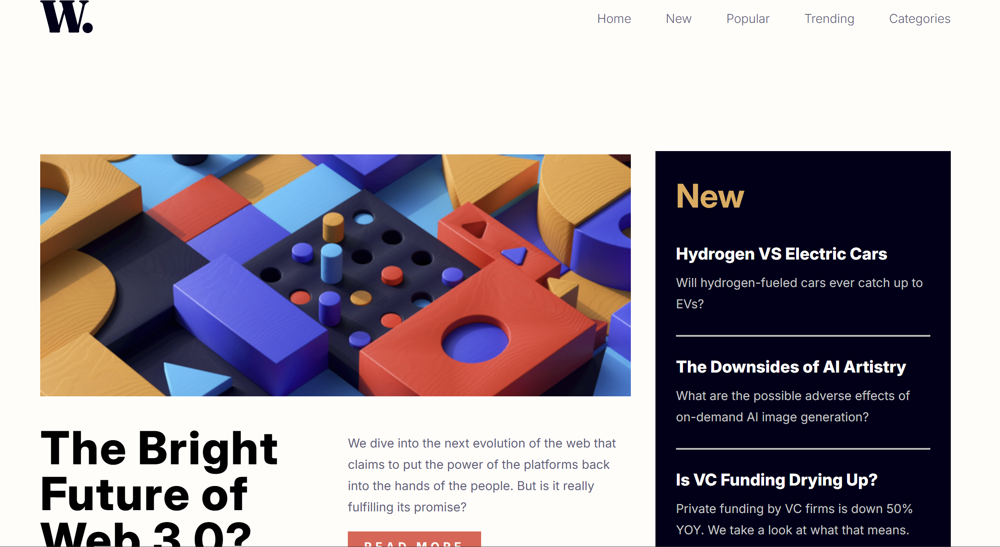

                                 ✨ FIGMA Exercise : Responsive Design with Burger Menu ✨





## ✏️ Description
Ce projet a consisté à concevoir un design responsive avec un menu burger qui se déclenche lorsque la page descend en-dessous d'un certain format d'écran. L'objectif principal était de créer une interface claire et fonctionnelle tout en divisant la page en plusieurs sections et containers, tout en gardant un code structuré et lisible. Ce projet met en avant l'utilisation de techniques comme les media queries, Flexbox et Grid pour garantir que le design reste fluide et réactif à différents types de périphériques.

## 💻 Technologies utilisées
**HTML5** : Pour structurer le contenu de la page, avec plusieurs containers et sections pour organiser l'information.
**CSS3** : Pour appliquer les styles visuels et rendre le design responsive, y compris l'intégration du menu burger.
Flexbox & Grid : Pour organiser le contenu de manière fluide et responsive.

## Caractéristiques principales 🚀
🎯 Menu Burger fonctionnel :
Création d'un menu de navigation qui se transforme en un menu burger lorsque l'écran devient plus petit, permettant une meilleure expérience utilisateur sur mobile.

🎨 Responsive Design :
Utilisation de media queries pour ajuster la mise en page selon la taille de l'écran, garantissant une navigation fluide aussi bien sur desktop que sur mobile.

📱 Containers et Sections :
Diviser la page en plusieurs sections et containers distincts pour un contenu bien structuré et organisé, tout en facilitant la gestion du style et du layout.

🧑‍🏫 Code lisible et structuré :
Veiller à ce que le code soit clair et bien commenté pour qu'il soit facile à comprendre et à maintenir, même pour d'autres développeurs.

🛠️ Fluidité et adaptabilité :
Utilisation des meilleures pratiques pour garantir que le site fonctionne bien sur des écrans de différentes tailles tout en restant cohérent visuellement.
## Lien: 

[ICI](https://figma-v5.vercel.app/#)

## 🛠️ Installation & Utilisation
1. Cloner le dépôt :
```
git clone https://github.com/BertrandM22/FigmaV5.git
```
2. Ouvrir le projet :
Ouvre le fichier index.html dans ton navigateur préféré pour voir le projet.
